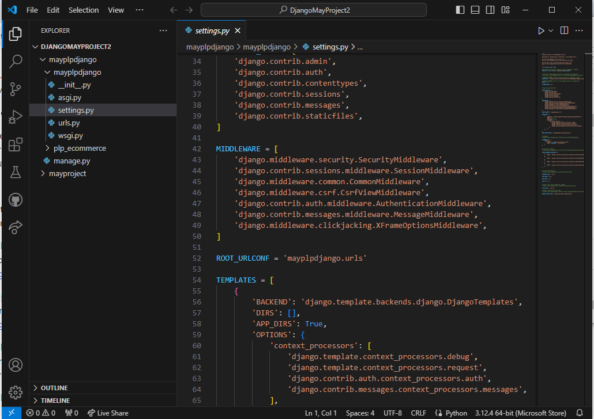

# Dev_Setup
Setup Development Environment

#Assignment: Setting Up Your Developer Environment

#Objective:
This assignment aims to familiarize you with the tools and configurations necessary to set up an efficient developer environment for software engineering projects. Completing this assignment will give you the skills required to set up a robust and productive workspace conducive to coding, debugging, version control, and collaboration.

#Tasks:

1. Select Your Operating System (OS):
   Choose an operating system that best suits your preferences and project requirements. Download and Install Windows 11. https://www.microsoft.com/software-download/windows11
. Check System Requirements
Before you start, ensure your PC meets the Windows 11 system requirements:

Processor: 1 gigahertz (GHz) or faster with at least 2 cores on a compatible 64-bit processor.
RAM: 4 GB or more.
Storage: 64 GB or larger storage device.
System Firmware: UEFI, Secure Boot capable.
TPM: Trusted Platform Module (TPM) version 2.0.
Graphics Card: DirectX 12 compatible graphics / WDDM 2.x.
Display: >9” with HD Resolution (720p).
2. Backup Your Data
Backup important files to an external drive or cloud storage to prevent data loss during installation.

3. Download Windows 11 Installation Media
Visit the Microsoft Windows 11 download page. Download the Windows 11 Installation Assistant or create a bootable USB drive using the Media Creation Tool.

4. Create a Bootable USB Drive
If using the Media Creation Tool:

Download and run the tool.
Select "Create installation media for another PC."
Choose language, edition, and architecture.
Select USB flash drive and follow the instructions to create the bootable media.
5. Install Windows 11
Using Installation Assistant:

Run the Installation Assistant and follow the prompts to upgrade your existing Windows installation.
Using Bootable USB:

Insert the USB drive into your PC.
Restart the PC and boot from the USB drive (you may need to change the boot order in the BIOS/UEFI settings).
Select your language, time, and keyboard preferences.
Click "Install now."
Enter the product key if prompted (you can skip this step if upgrading).
Choose the installation type: Upgrade (keep files and settings) or Custom (fresh installation).
Follow the on-screen instructions to complete the installation.
6. Post-Installation Setup
After installation, follow the setup prompts to configure your settings, create or log in to your Microsoft account, and personalize your new Windows 11 environment.

7. Update Drivers and Software
Check for updates via Windows Update and install the latest drivers and software to ensure optimal performance.

2. Install a Text Editor or Integrated Development Environment (IDE):
 1.  Select and install a text editor or IDE suitable for your programming languages and workflow. Download and Install Visual Studio Code. https://code.visualstudio.com/Download
    Download the Installer
Visit the official Visual Studio Code website.
Click on the download button for your operating system (Windows, macOS, or Linux).
2. Run the Installer (Windows)
Once the download is complete, open the installer file.
Follow the installation wizard. Accept the license agreement, choose the installation location, and select any additional tasks (such as adding to the PATH, creating a desktop icon, etc.).
Click "Install" to begin the installation process.
3. Install via Package Manager (macOS)
Open Terminal and run:
bash
Copy code
brew install --cask visual-studio-code
Ensure you have Homebrew installed before running the command.
4. Install via Package Manager (Linux)
For Debian-based systems (Ubuntu):
bash
Copy code
sudo apt update
sudo apt install software-properties-common apt-transport-https wget
wget -q https://packages.microsoft.com/keys/microsoft.asc -O- | sudo apt-key add -
sudo add-apt-repository "deb [arch=amd64] https://packages.microsoft.com/repos/vscode stable main"
sudo apt update
sudo apt install code
For RPM-based systems (Fedora, CentOS):
bash
Copy code
sudo rpm --import https://packages.microsoft.com/keys/microsoft.asc
sudo sh -c 'echo -e "[code]\nname=Visual Studio Code\nbaseurl=https://packages.microsoft.com/yumrepos/vscode\nenabled=1\ngpgcheck=1\ngpgkey=https://packages.microsoft.com/keys/microsoft.asc" > /etc/yum.repos.d/vscode.repo'
sudo dnf check-update
sudo dnf install code
5. Launch VS Code
Open VS Code from the Start menu (Windows), Launchpad (macOS), or Applications menu (Linux).
Optionally, you can pin it to your taskbar or dock for easier access.
6. Install Extensions
Open VS Code, click on the Extensions view icon on the sidebar, and search for extensions to enhance your development experience.
   
3. Set Up Version Control System:
  1. Install Git and configure it on your local machine. Create a GitHub account for hosting your repositories. Initialize a Git repository for your project and make your first commit. https://github.com
   Visit the GitHub Website
Open your web browser and go to GitHub's homepage.
2. Sign Up for an Account
Click on the "Sign up" button in the top-right corner of the homepage.
Enter your preferred username, email address, and a secure password.
Click on the "Create account" button.
3. Verify Your Account
GitHub will send a verification email to the address you provided. Check your email inbox and click the verification link in the email.
If prompted, solve the CAPTCHA to prove you are not a robot.
4. Complete the Setup
After verification, GitHub may ask you a few questions to customize your experience. This may include selecting your interests and choosing between a free or paid plan.
Choose the "Free" plan unless you need advanced features available in the paid plans.
5. Personalize Your Profile
Once your account is created, you can personalize your GitHub profile by adding a profile picture, bio, and other details.
Navigate to your profile by clicking on your avatar in the top-right corner and selecting "Your profile."
6. Start Using GitHub
You can now create new repositories, fork existing ones, and start collaborating on projects.
Explore GitHub's features like Issues, Pull Requests, and GitHub Pages

4. Install Necessary Programming Languages and Runtimes:
  Instal Python from http://wwww.python.org programming language required for your project and install their respective compilers, interpreters, or runtimes. Ensure you have the necessary tools to build and execute your code.
  1: Download Python Installer
Visit the official Python website: Go to python.org.
Download the installer: Click the "Download Python" button. The website will suggest the latest stable release.
Step 2: Run the Installer
Open the installer: Locate the downloaded .exe file (usually in your Downloads folder) and run it.
Customize installation:
Check "Add Python to PATH": This option allows you to use Python from the command line.
Select "Customize installation" if you want to choose optional features or install for all users.
Step 3: Customize Installation (Optional)
Optional features: Select any additional features you need, like pip (package manager), documentation, or Tcl/Tk support.
Advanced options: You can change the installation directory or install for all users here.
Step 4: Complete the Installation
Install: Click "Install Now" or "Install" in the customization window. The installation process will start.
Wait for completion: Once finished, you’ll see a “Setup was successful” message.
Step 5: Verify Installation
Open Command Prompt: Press Win + R, type cmd, and press Enter.
Check Python version: Type python --version to verify the installation. You should see the installed Python version.
Check pip version: Type pip --version to ensure pip is installed and working.

5. Install Package Managers:
   If applicable, install package managers like pip (Python).
   Type pip --version to check that pip is installed

6. Configure a Database (MySQL):
   Download and install MySQL database. https://dev.mysql.com/downloads/windows/installer/5.7.html 
To install MySQL, first, download the MySQL installer from the official MySQL website. Run the installer and follow the setup wizard, selecting "Server only" for a minimal installation. Accept the license agreement, choose the default installation directory, and configure the MySQL server by setting the root password and selecting the appropriate authentication method. Continue through the installation steps, ensuring to configure MySQL as a Windows service for automatic startup. After installation, complete the setup by starting the MySQL server and testing the connection using the MySQL Workbench or the command-line client.

7. Set Up Development Environments and Virtualization (Optional):
   Consider using virtualization tools like Docker or virtual machines to isolate project dependencies and ensure consistent environments across different machines.

8. Explore Extensions and Plugins:
   Explore available extensions, plugins, and add-ons for your chosen text editor or IDE to enhance functionality, such as syntax highlighting, linting, code formatting, and version control integration.

9. Document Your Setup:
    Create a comprehensive document outlining the steps you've taken to set up your developer environment. Include any configurations, customizations, or troubleshooting steps encountered during the process. 
[text](../Users/user/OneDrive/Documents/python.docx)
#Deliverables:
- Document detailing the setup process with step-by-step instructions and screenshots where necessary.
- A GitHub repository containing a sample project initialized with Git and any necessary configuration files (e.g., .gitignore).
- A reflection on the challenges faced during setup and strategies employed to overcome them.

#Submission:
Submit your document and GitHub repository link through the designated platform or email to the instructor by the specified deadline.

#Evaluation Criteria:**
- Completeness and accuracy of setup documentation.
- Effectiveness of version control implementation.
- Appropriateness of tools selected for the project requirements.
- Clarity of reflection on challenges and solutions encountered.
- Adherence to submission guidelines and deadlines.

Note: Feel free to reach out for clarification or assistance with any aspect of the assignment.
